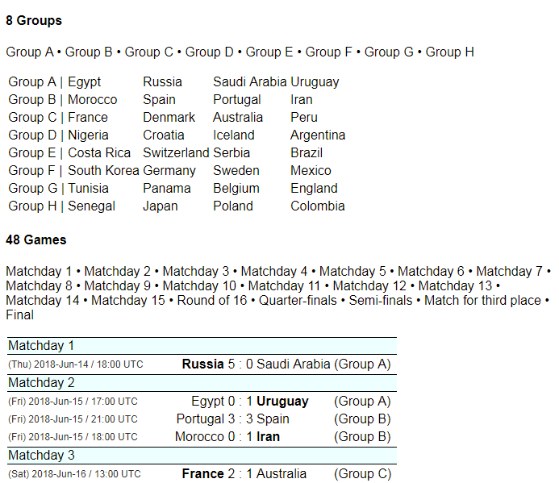

# sportweb gem - instant open sports web admin browser command line tool

* home  :: [github.com/sportdb/sport.db.web](https://github.com/sportdb/sport.db.web)
* bugs  :: [github.com/sportdb/sport.db.web/issues](https://github.com/sportdb/sport.db.web/issues)
* gem   :: [rubygems.org/gems/sportweb](https://rubygems.org/gems/sportweb)
* rdoc  :: [rubydoc.info/gems/sportweb](http://rubydoc.info/gems/sportweb)
* forum :: [groups.google.com/group/opensport](https://groups.google.com/group/opensport)

## Usage

#### Step 0: Build yourself a local worldcup database from scratch (zero).

Use the sportdb command line tool machinery to build yourself a local single-file SQLite database
from the (online) datasets from scratch (zero) using the [`worldcup.rb` datafile](https://github.com/openfootball/datafile/blob/master/worldcup.rb). Type in your shell:

    $ mkdir worldcup
    $ cd worldcup
    $ sportdb new worldcup              # use the worldcup.rb datafile   

#### Step 1: Start the instant web server.

Type in your shell:

    $ sportweb

or

    $ sportweb worldcup.db

Note: The web server runs by default on port `3000`.

    >> Puma starting in single mode...
    >> * Version 3.11.4 (ruby 2.4.4-p296), codename: Love Song
    >> * Listening on tcp://0.0.0.0:3000
    >> Use Ctrl-C to stop

#### Step 2: Open your web browser.

Open your web browser of choice (e.g. [`localhost:3000`](http://localhost:3000))
and start browsing your open sports database
(e.g. `sport.db`, `football.db`, `worldcup.db`, etc.).

Example - World Cup 2018 in Russia:

That's it.

## Install

Just install the gem:

    $ gem install sportweb

## License

The `sportweb` scripts are dedicated to the public domain.
Use it as you please with no restrictions whatsoever.

## Questions? Comments?

Send them along to the
[Open Sports & Friends Forum/Mailing List](http://groups.google.com/group/opensport).
Thanks!
